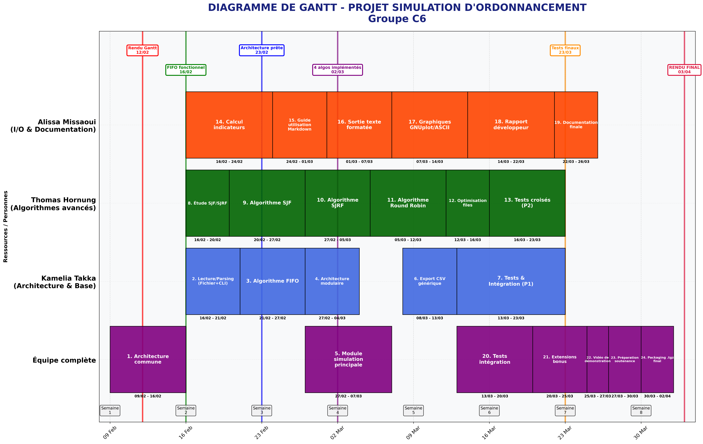

# Scheduling_Simulator

**Simulateur d'ordonnancement de processus en C**  
*Projet L3 Informatique - Groupe TD C*

---

## Équipe
| Membre | Rôle principal |
|--------|----------------|
| Alissa Missaoui | I/O, documentation & rapports |
| Thomas Hornung | Algorithmes avancés |
| Kamelia Takka | Architecture & modules de base |

---

## Diagramme de Gantt (Planification)



> Ce diagramme illustre la planification des tâches, l’occupation des ressources et les jalons clés du projet.  
> Les couleurs représentent les responsabilités principales :  
> - Violet : Équipe complète  
> - Bleu : P1 / Kamelia  
> - Vert : P2 / Thomas  
> - Orange : P3 / Alissa  
> Les jalons importants sont indiqués par des lignes verticales colorées.

---

## Dépendances critiques
1. **Architecture commune → Tous les modules**  
2. **FIFO → Tests unitaires**  
3. **SJF/SJRF/RR → Tests croisés**  
4. **Tous tests → Intégration**  
5. **Intégration → Packaging final**

---

## Dates clés
| Date | Événement | Détail |
|------|-----------|--------|
| 12/02/2026 | Rendu Gantt | Diagramme de planification |
| 16/02/2026 | FIFO fonctionnel | Premier algorithme opérationnel |
| 23/02/2026 | Architecture prête | Base modulaire finalisée |
| 02/03/2026 | 4 algos implémentés | Tous algorithmes terminés |
| 23/03/2026 | Tests finaux | Validation complète |
| 03/04/2026 | **RENDU FINAL** | Archive .tgz sur Moodle |

---

## Objectifs du projet
Le but est d’implémenter un simulateur d’ordonnancement de processus en **C**, en mode console.

### Entrées
- Processus avec durées CPU et E/S (ms)
- Via **ligne de commande** ou fichier texte (format à définir)

### Sorties
- **Textuelle (obligatoire)** : indicateurs exportables en CSV
- **Graphique (optionnel)**

### Indicateurs obligatoires
- Temps d’attente moyen et par processus
- Temps de restitution (turnaround) moyen et par processus
- Temps de réponse moyen et par processus
- Taux d’occupation du CPU

### Algorithmes à implémenter
- FIFO  
- SJF  
- SJRF (SRTF)  
- Round Robin (RR)  

### Extensibilité
Architecture modulaire pour ajouter facilement d’autres algorithmes (décrite dans le rapport développeur).

---

## Livrables
Archive finale : `L3_I-OS-Projet-NOM1-NOM2-NOM3.tgz` comprenant :

1. **Code source en C**  
   - Commenté avec en-tête indiquant la participation de chaque membre  
   - Compatible Doxygen
2. **Makefile**  
   - Génération exécutable et documentation
3. **Rapport développeur (PDF)**  
   - Structures de données et algorithmes  
   - Guide ajout de nouveaux algorithmes
4. **Guide d’utilisation (Markdown)**  
   - Installation et utilisation
5. **Diaporama (ODP + PDF)**  
   - Maximum 12 diapositives
6. **Vidéo de démonstration (MKV, H.265, 1080p)**  
   - Durée max 3 minutes  
   - Présentation complète des fonctionnalités

### Bonus possibles
- Interface graphique pour résultats
- Génération automatique de graphiques
- Gestion des E/S non parallélisables

---

## Échéances importantes
- Formation des groupes : mail à jean-luc.bourdon@cyu.fr avant le 23/01/2026  
- Dépôt final : archive Moodle avant le 03/04/2026  
  - Pénalité : 1 point/jour (max 5 points)  
- Soutenance : 7, 8 ou 9 avril 2026  
  - 20 min (10 min présentation + 10 min questions)

---

## Méthode de gestion (FDD)
- **Modélisation initiale** : architecture du simulateur, structures et interfaces  
- **Liste des features** :
  1. Lecture fichier/commande  
  2. Algorithme FIFO  
  3. Algorithme SJF  
  4. Algorithme SJRF  
  5. Algorithme RR  
  6. Calcul indicateurs  
  7. Export CSV  
  8. Sortie graphique (optionnel)  
  9. Bonus
- **Planification par feature** : Février → Avril  
- **Développement itératif** : chaque feature est conçue, codée, testée et intégrée avant la suivante  
- **Livraisons régulières** : versions fonctionnelles partielles disponibles après chaque feature

---

## Installation rapide
```bash
git clone https://github.com/votre-compte/Scheduling_Simulator.git
cd Scheduling_Simulator
make
./Scheduling_Simulator input.txt
```

## Structure du projet
```bash
Scheduling_Simulator/
├── src/                    # Code source C
├── include/                # Headers
├── docs/                   # Documentation
├── tests/                  # Tests
├── examples/               # Fichiers d'exemple
├── Makefile
└── README.md               # Ce fichier
```
