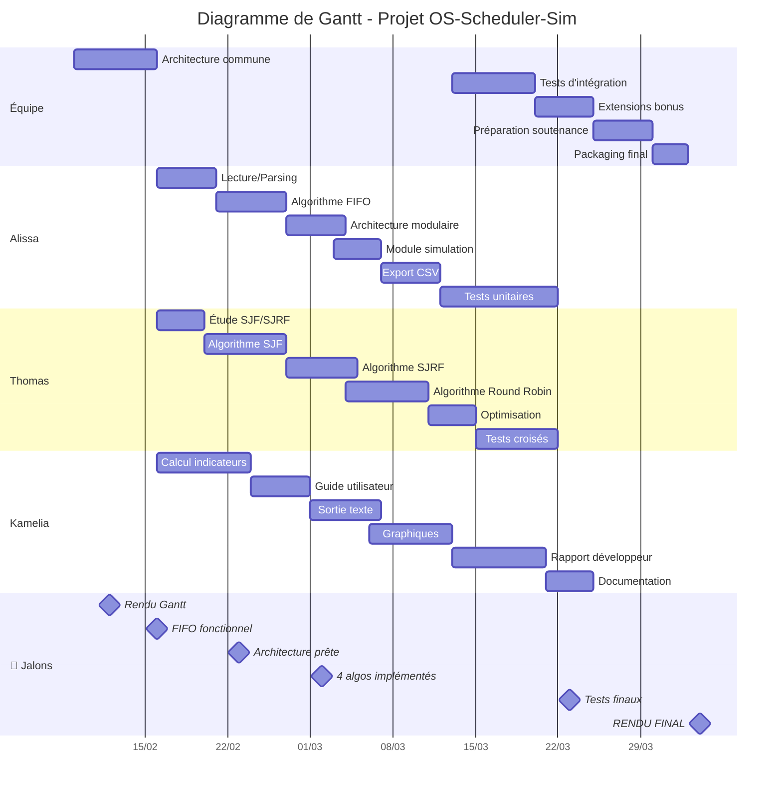

# Scheduling_Simulator


**Simulateur d'ordonnancement de processus en C**  
*Projet L3 Informatique - Groupe TD C*

## Équipe
| Membre | Rôle principal |
|--------|----------------|
| Alissa Missaoui | I/O, documentation & rapports |
| Thomas Hornung | Algorithmes avancés |
| Kamelia Takka | Architecture & modules de base|

##  Diagramme de Gantt (Planification)



##  Dépendances critiques
1. **Architecture → Tous modules**
2. **FIFO → Tests unitaires**
3. **SJF/SJRF/RR → Tests croisés**
4. **Tous tests → Intégration**
5. **Intégration → Packaging**

##  Dates clés
| Date | Événement | Détail |
|------|-----------|--------|
| 12/02/2026 | Rendu Gantt | Diagramme de planification |
| 16/02/2026 | FIFO fonctionnel | Premier algorithme opérationnel |
| 02/03/2026 | 4 algos prêts | Tous algorithmes implémentés |
| 23/03/2026 | Tests finaux | Validation complète |
| 03/04/2026 | **RENDU FINAL** | Archive .tgz sur Moodle |

##  Installation rapide
```bash
git clone https://github.com/votre-compte/Scheduling_Simulator.git
cd Scheduling_Simulator
make
./Scheduling_Simulator input.txt
```

##  Structure du projet
```
Scheduling_Simulator/
├── src/                    # Code source C
├── include/               # Headers
├── docs/                  # Documentation
├── tests/                 # Tests
├── examples/              # Fichiers d'exemple
├── Makefile
└── README.md              # Ce fichier
```


---

*Dernière mise à jour : Février 2026 | Projet académique - CYU*
